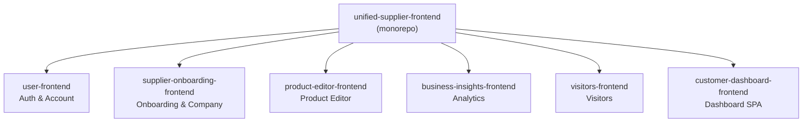

# Module Map

## Module → Entry File

## Entry Points per Module

| Module | Primary Entry | Framework |
|--------|--------------|-----------|
| [User Account & Auth](../04_modules/user-account-auth.md) | `user-frontend/routes.ts` | Nuxt 3 |
| [Supplier Onboarding](../04_modules/supplier-onboarding.md) | `supplier-onboarding-frontend/nuxt.config.ts` | Nuxt 3 |
| [Product Editor](../04_modules/product-editor.md) | `product-editor-frontend/nuxt.config.ts` | Nuxt 4 |
| [Business Insights](../04_modules/business-insights.md) | `business-insights-frontend/nuxt.config.ts` | Nuxt 3 |
| [Visitors](../04_modules/visitors.md) | `visitors-frontend/nuxt.config.ts` | Nuxt 3 |
| [Customer Dashboard](../04_modules/customer-dashboard.md) | `customer-dashboard-frontend/src/main.ts` | Vue 3 + Vite |
