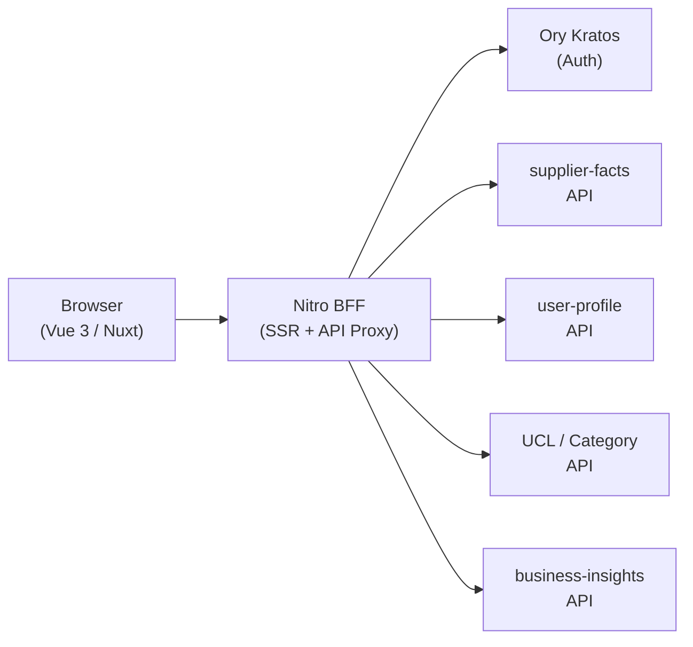
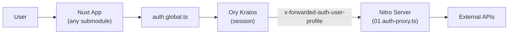

# System Map

## Layers

## App Layer Map

| App | Render | Entry |
|-----|--------|-------|
| `user-frontend` | Nuxt SSR | Login, registration, account settings |
| `supplier-onboarding-frontend` | Nuxt SSR | Company editor, product onboarding, member mgmt |
| `product-editor-frontend` | Nuxt SSR | Product listing and quick editor |
| `business-insights-frontend` | Nuxt SSR | Analytics dashboards |
| `visitors-frontend` | Nuxt SSR | Visitor list and website leads |
| `customer-dashboard-frontend` | Vue 3 SPA (Vite) | Company overview dashboard |

## Auth Flow

