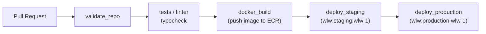

# Deploy Guide

## Build

| Submodule | Command |
|-----------|---------|
| `product-editor-frontend` | `pnpm build` |
| `supplier-onboarding-frontend` | `pnpm build` |
| `business-insights-frontend` | `yarn build` |
| `user-frontend` | `yarn build` |
| `customer-dashboard-frontend` | `pnpm run build` |
| `visitors-frontend` | `npm run build` |

## Docker

All apps use multi-stage Dockerfiles:

- Nuxt apps → `node build stage` → CMD `node --require dd-trace/init .output/server/index.mjs`
- `user-frontend` → `bin/env node .output/server/index.mjs` (env mapping script)
- `customer-dashboard-frontend` → nginx static SPA at `/company-overview`

Build image: `docker build --target prod .`

## CI/CD Pipeline

- PR → validate + tests + docker_build (no deploy)
- Push to `main` → full pipeline including staging + production deploy
- Scheduled deploys → weekday staging re-deploy (most apps)
- Manual deploy workflow → available for `customer-dashboard-frontend`

## Deploy Metadata

Each app has a `visable.yaml` declaring service name, Docker image, and pipeline hooks.

Pre-deploy hook: `bin/before_deploy` (runs before each deploy step).
